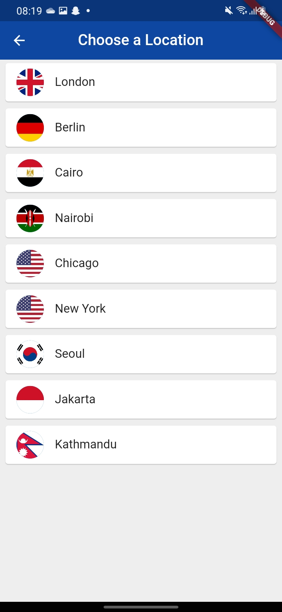

# world_time

A Flutter project app showing current time at different parts of the world.

### Done with reference to [The Net Ninja Youtube channel](https://www.youtube.com/c/TheNetNinja)

**ReCoded  by:**
>Amit Duwal   [Contact](https://www.linkedin.com/in/amit-duwal-696310200/)

Just Fun Learning with  flutter

### Homepage

### Choose city

### Night Berlin

